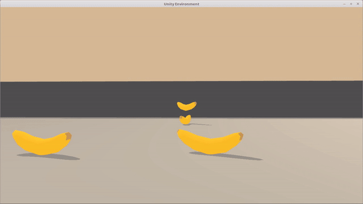

# Navigation

## Table of Contents

1. [Introduction](#introduction)
2. [Directory Structure](#directoryStructure)
3. [Installation](#installation)
4. [Instructions](#insrructions)
5. [Results](#results)

## Introduction <a name="introduction"></a>
The goal of this project, is to train an agent to navigate (and collect bananas!) in a large, square world.
A reward of +1 is provided for collecting a yellow banana, and a reward of -1 is provided for collecting a blue banana. Thus, the goal of your agent is to collect as many yellow bananas as possible while avoiding blue bananas.

<p align="center">
    
</p>

<p align="center">
    
</p>
The state space has 37 dimensions and contains the agent's velocity, along with ray-based perception of objects around agent's forward direction. 

The 35 dimensions of ray perception contain the following bits of informaton: 
- 7 rays are projecting from the agent at the following angles (measured in degrees): [20, 90, 160, 45, 135, 70, 110] where 90 is directly in front of the agent. 
- Each ray is 5 dimensional. If it encounters a detectable object (i.e. yellow banana, wall, blue banana, agent), the value at that position in the array is set to 1. 

The last number within each ray is a distance measure which is a fraction of the ray length normalized to 1. Each ray is [Yellow Banana, Wall, Blue Banana, Agent, Distance]. For example, [0,1,1,0,0,0.2] means that there is a blue banana detected at 20% of the distance.

The velocity of the agent is two dimensional: left/right velocity and forward/backward velocity. 

Given this information, the agent has to learn how to best select his actions. Four discrete actions are available:

- 0 - move forward.
- 1 - move backward.
- 2 - turn left.
- 3 - turn right.

The task is episodic, and in order to solve the environment, your agent must get an average score of +13 over 100 consecutive episodes.

## Directory Structure <a name="directoryStructure"></a>

- Root /
    - README.md (This readme file)
    - Report.md (A report describing results)
    - agent.py (The python code for the learning agent)
    - model.py (The neural networks)
    - Navigation_Solution.ipynb (A Jupyter notebook used to sove the RL problem)
    - dqn.pth (The neural network weights for the DQN solution)
    - double_dqn.pth (The neural network weights for the DoubleDQN solution)
    - dueling_dqn.pth (The neural network weights for the DuelingDQN solution)
    - images /  
        - banana.gif  (Animated image of environment)
        - banana.png (Image of environment)
        - dqn_scores.png (Plot of scores for DQN solution)
        - double_dqn_scores.png (Plot of scores for DoubleDQN solution)
        - dueling_dqn_scores.png (Plot of scores for DuelingDQN solution)
   
## Installation <a name="installation"></a>

This project was written in Python 3.6, using a Jupyter Notebook on Anaconda. Currently (Septemebr 2019) you cannot use Python 3.7, since tensorflow 1.7.1 doesn't have a version corresponding to python 3.7 yet.

The relevant Python packages for this project are as follows:

- numpy
- torch
- unityagents
- matplotlib

In addition to installing the above package the Unity environment has to be installed. This includes the following steps:

1. Download the environment from one of the links below.  You need only select the environment that matches your operating system:
    - Linux: [click here](https://s3-us-west-1.amazonaws.com/udacity-drlnd/P1/Banana/Banana_Linux.zip)
    - Mac OSX: [click here](https://s3-us-west-1.amazonaws.com/udacity-drlnd/P1/Banana/Banana.app.zip)
    - Windows (64-bit): [click here](https://s3-us-west-1.amazonaws.com/udacity-drlnd/P1/Banana/Banana_Windows_x86_64.zip)
    
 2. Copy the downloaded file in this folder, unzip (or decompress) the file and then write the correct path in the argument for creating the environment under the notebook `Navigation_Solution.ipynb`:

```python
env = UnityEnvironment(file_name="Banana.app")
```

## Instructions <a name="instructions"></a>

Follow the instructions in Navigation_Solution.ipynb to get started.

In order to train a network you have to create an agent:

agent = Agent(state_size=state_size, action_size=action_size, dqnetwork= DQNetwork, update_type='dqn', seed=42)

The implementation supports 3 different learning algorithms:

- DQN: Use DQNetwork as a parameter for dqnetwork, and 'dqn as update_type
- Double DQN: Use DQNetwork as a parameter for dqnetwork, and 'double_dqn as update_type
- Dueling Double DQN: Use DuelingQNetwork as a parameter for dqnetwork, and 'double_dqn as update_type

Feel free to modify the hyperparameters !

In order to see an agent in action, load the corresponding network:

agent.qnetwork_local.load_state_dict(torch.load('dqn.pth'))

There are 3 saved model weights for the 3 different algorithms:

- DQN: dqn.pth
- Double DQN: double_dqn.pth
- Dueling Double DQN: dueling_dqn.pth

## Results <a name="results"></a>

The environment was solved in 377 episodes (currently). Below are plots showing the learning of all 3 algorithms. 

A more detailed description of results can be found in the Report.md file.

