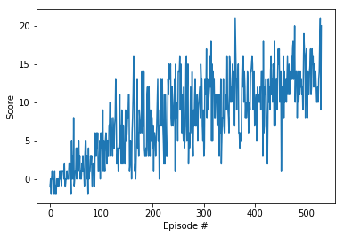

# Project 1: Navigation

Author: [Harald Wilbertz](http://github.com/wilbertz) 

The project uses Reinforcement Learning methods, in particular: [Deep Q-learning](https://storage.googleapis.com/deepmind-media/dqn/DQNNaturePaper.pdf) and several variants, to learn a suitable policy using the Unity banana environment. 
The environment consists of a continuous state space with the goal to collect yellow bananas (reward: +1) while avoiding blue bananas (reward: -1). 
The state space has 37 dimensions and contains the agent's velocity, along with ray-based perception of objects around agent's forward direction. There are 4 actions to choose from: move left, move right, move forward and move backward. 

The report contains three parts:

- **Design and Implementation**
- **Results**
- **Future Improvements** 

## Design and Implementation

At the core of the learning algorithm is [Deep Q-learning](https://storage.googleapis.com/deepmind-media/dqn/DQNNaturePaper.pdf), 
which exceeded human-level performance in 49 Atari games. The algorithm is a modification of Q-learning. Q-learning belongs to the class of Temporal-Difference learning (TD-learning) methods. The idea of Q-learning is to learn an action-value function, that estimates future rewards given a state and a choosen action.

Due to the fact that our space is continous, a traditional tabular representation cannot be used. Deep neural networks are used as universal function approximators instead. Using a function approximator, we update the weights of the function approximator.

- **Fixed Q-targets**: 
As can be seen from the equation above, the target during training itself is dependent on `w`, the parameter being updated. This leads to constantly moving targets and hurts training. The idea behind fixed q-targets is to fix the parameter `w` used in the calculation of the target, $\hat{Q}(s, a; w)$. This is achieved by having two separate networks, one is the online network being learned and the other being the target network. The weights of the target network are taken from the online network itself by freezing the model parameters for a few iterations and updating it periodically after a few steps. By freezing the parameters this way, it ensures that the target network parameters are significantly different from the online network parameters.

- **Experience Buffer**: 
We are trying to approximate a complex linear function Q with a neural network. One of the fundamental requirements for SGD (Stochastic Gradient Descent) is that the training data are idependent and identically distributed. (abbreviated as i.i.d.) But our samples are not independent. Even with a large batch of samples, most of them will be quite cloase to each other, since they belong to the same episode.
In addition the distribution of training data is not identical to the samples provided by the optimal policy, that should be learned. To avoid these problems, a large buffer of past experiences is used. The current implementation uses a buffer of fixed size, with new data added to the end of the buffer, pushing older experiences out of it. 

Both of the above mentioned techniques were incorporated. The entire implementation was done in PyTorch. Also, various other improvements have been proposed upon the original DQN algorithm, and this repository contains the implementations of two of those:

- **Double DQN**: 
The basic DQN has a tendency to overestimate the values for Q. This can be harmful for training performance and results in suboptimal policies. The main reason for this behaviour is the use of the max operation in the Bellman equation. In a paper [Deep Reinforcement Learning with Double Q-Learning](http://arxiv.org/abs/1509.06461) the authors van Hasselt, Guez and Silver proposed a solution.
The idea of Double DQN is to disentangle the calculation of the Q-targets into finding the best action and then calculating the Q-value for that action in the given state. Double DQN use one network to choose the best action and the other to evaluate that action. The idea is that if one network chose an action as the best one by mistake, chances are that the other network wouldn't have a large Q-value for the sub-optimal action. 

- **Dueling Network**: 
In a paper [Dueling Network architecture for Deep Reinforcement Learning](https://arxiv.org/abs/1511.06581) the authors Ziyu Wang, Tom Schaul, Matteo Hessel, Hado van Hasselt, Marc Lanctot, Nando de Freitas described further improvements for DQN's.
Their dueling network uses two separate estimators: one for the state value function and one for the state-dependent action advantage function. The main benefit of this factoring is to generalize learning across actions without imposing any change to the underlying reinforcement learning algorithm. Their results show that this architecture leads to better policy evaluation in the presence of many similar-valued actions.

  ### Hyperparameters

  The code uses a lot of hyperparameters. The values a are given below

  | Hyperparameter                      | Value |
  | ----------------------------------- | ----- |
  | Experience buffer size              | 10000 |
  | Batch size                          | 64    |
  | Gamma (discount factor)             | 0.99  |
  | Tau                                 | 1e-3  |
  | Number of episodes                  | 500   |
  | Update interval                     | 5     |
  | Learning rate                       | 1e-3  |
  | Max number of steps per episode     | 2000  |
  | Epsilon start                       | 1.0   |
  | Epsilon minimum                     | 0.1   |
  | Epsilon decay                       | 0.99  |

## Results

The best performance was achieved by **Double DQN** where the reward of +13 was achieved in **377** episodes. The plots of the rewards for the different variants of DQN is shown below:

| Double DQN                                 | DQN                                | Dueling DQN                                         |
| ------------------------------------------ | ---------------------------------- | --------------------------------------------------- |
|  |  |  |

## Ideas for improvement

- Using Prioritized Replay ([paper](https://arxiv.org/abs/1511.05952)) showed a massive improvement over Double DQNs for Atari games. It is expected that it'll lead to an improved performance here too.
- Other improvements to the original DQN algorithms that were briefly mentioned in the course could be  potentially beneficial too: learning from [multi-step bootstrap targets](https://arxiv.org/abs/1602.01783) , [Distributional DQN](https://arxiv.org/abs/1707.06887), [Noisy DQN](https://arxiv.org/abs/1706.10295)
- Hyperparameter search should improve the performance too.
